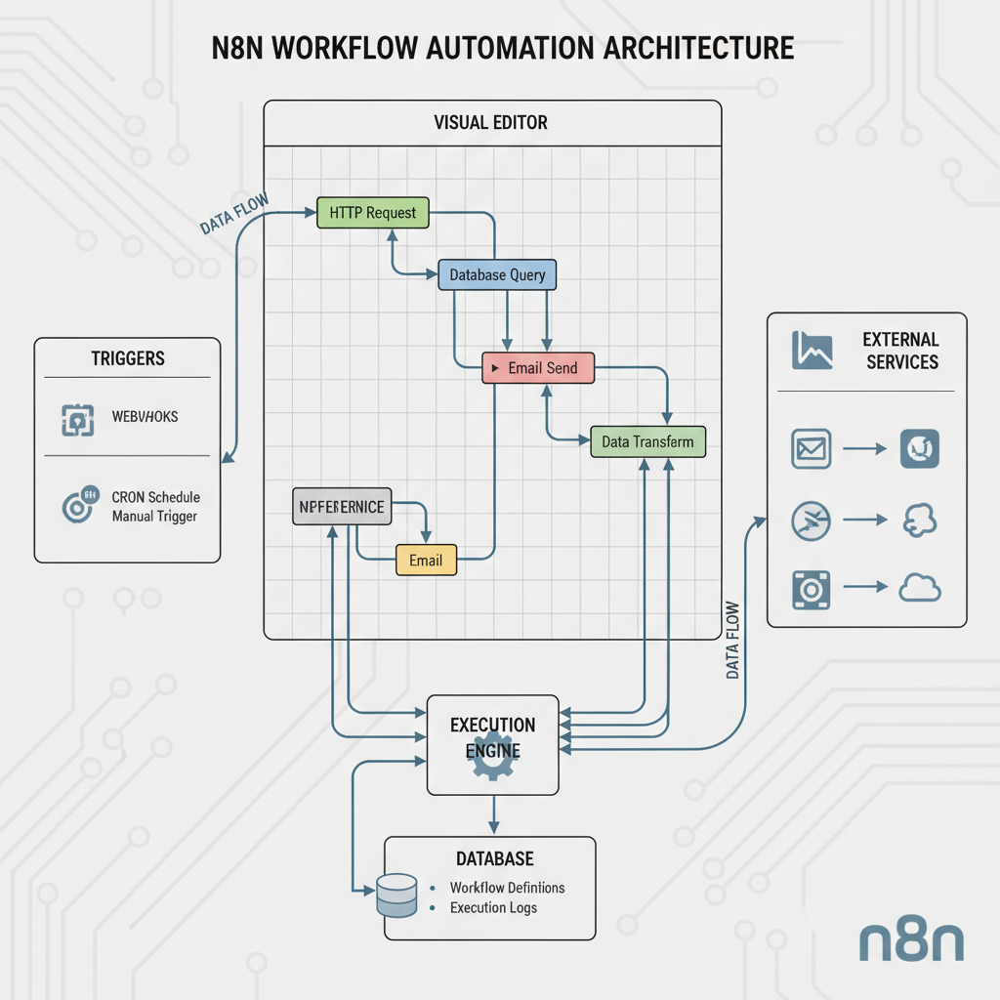

# n8n Workflow Automation Templates 🚀



## Overview
https://www.n8nfreeshare.online/ FOR MORE TEMPLATES 
GDRIVE : https://drive.google.com/drive/folders/1nkwDEbFOLyvkjGtYZ9MbOI4v-wLSpmQD?usp=drive_link

This repository contains a comprehensive collection of **n8n workflow automation templates** designed to streamline business processes and increase productivity. Whether you're automating marketing campaigns, managing CRM data, or processing documents, these templates provide ready-to-use solutions that can save hours of manual work.

**n8n** is a powerful, open-source workflow automation platform that enables you to connect different applications and services through an intuitive visual interface. With over 400+ integrations and unlimited self-hosted executions, n8n is the perfect solution for businesses looking to scale their automation efforts.

## 🏗️ Architecture

n8n follows a modular architecture that ensures scalability, reliability, and ease of use:

### Core Components

- **Visual Editor (Frontend)**: Intuitive drag-and-drop interface for designing workflows
- **Workflow Execution Engine**: Processes workflows node-by-node with error handling and logging
- **Node System**: 400+ pre-built integrations plus custom node support
- **Database Layer**: Stores workflows, credentials, execution logs, and user data
- **Trigger System**: Webhooks, schedules, and event-based workflow initiation
- **API Gateway**: RESTful API for programmatic workflow management

### Data Flow
1. **Design Phase**: Create workflows using the visual editor
2. **Trigger Activation**: Workflows start via webhooks, schedules, or manual triggers
3. **Execution**: Engine processes nodes sequentially with data transformation
4. **Logging**: Comprehensive execution logs for debugging and monitoring
5. **Integration**: Seamless communication with external services and APIs

## 📦 Installation Guide

### Prerequisites

- **Node.js** (version 16 or higher)
- **npm** (Node Package Manager)
- **Git** (for version control)
- Supported databases: SQLite (default), PostgreSQL, or MySQL/MariaDB

### Method 1: Quick Start (Local Development)

```bash
# Install Node.js (if not already installed)
# Visit https://nodejs.org and download the latest LTS version

# Install n8n globally
npm install n8n -g

# Start n8n
n8n start

# Access the interface at http://localhost:5678
```

### Method 2: Docker Installation (Recommended for Production)

```bash
# Pull the n8n Docker image
docker pull n8nio/n8n

# Run with persistent storage
docker run -d --name n8n \
  -p 5678:5678 \
  -v ~/.n8n:/home/node/.n8n \
  n8nio/n8n

# With environment variables for production
docker run -d --name n8n \
  -p 5678:5678 \
  -e N8N_BASIC_AUTH_ACTIVE=true \
  -e N8N_BASIC_AUTH_USER=your_username \
  -e N8N_BASIC_AUTH_PASSWORD=your_secure_password \
  -e N8N_HOST=yourdomain.com \
  -e WEBHOOK_URL=https://yourdomain.com/ \
  -v ~/.n8n:/home/node/.n8n \
  n8nio/n8n
```

### Method 3: Docker Compose (Enterprise Setup)

Create a `docker-compose.yml` file:

```yaml
version: '3.8'

services:
  n8n:
    image: n8nio/n8n
    restart: always
    ports:
      - "5678:5678"
    environment:
      - N8N_BASIC_AUTH_ACTIVE=true
      - N8N_BASIC_AUTH_USER=admin
      - N8N_BASIC_AUTH_PASSWORD=secure_password
      - N8N_HOST=${DOMAIN_NAME}
      - WEBHOOK_URL=https://${DOMAIN_NAME}/
      - GENERIC_TIMEZONE=${GENERIC_TIMEZONE}
      - DB_TYPE=postgresdb
      - DB_POSTGRESDB_HOST=postgres
      - DB_POSTGRESDB_PORT=5432
      - DB_POSTGRESDB_DATABASE=${POSTGRES_DB}
      - DB_POSTGRESDB_USER=${POSTGRES_USER}
      - DB_POSTGRESDB_PASSWORD=${POSTGRES_PASSWORD}
    volumes:
      - n8n_data:/home/node/.n8n
    depends_on:
      - postgres

  postgres:
    image: postgres:13
    restart: always
    environment:
      - POSTGRES_DB=${POSTGRES_DB}
      - POSTGRES_USER=${POSTGRES_USER}
      - POSTGRES_PASSWORD=${POSTGRES_PASSWORD}
    volumes:
      - postgres_data:/var/lib/postgresql/data

volumes:
  n8n_data:
  postgres_data:
```

Run with:
```bash
docker-compose up -d
```

### Post-Installation Setup

1. **Access the Interface**: Open your browser to `http://localhost:5678`
2. **Create Admin Account**: Set up your first user account
3. **Configure Webhooks**: Set up your domain for external triggers
4. **Install Community Nodes**: Add additional integrations as needed

```bash
# Install community nodes (example)
npm install n8n-nodes-[node-name]
```

## 🔧 Configuration

### Environment Variables

Key environment variables for production deployment:

```bash
# Basic Authentication
N8N_BASIC_AUTH_ACTIVE=true
N8N_BASIC_AUTH_USER=admin
N8N_BASIC_AUTH_PASSWORD=secure_password

# Database Configuration
DB_TYPE=postgresdb
DB_POSTGRESDB_HOST=localhost
DB_POSTGRESDB_PORT=5432
DB_POSTGRESDB_DATABASE=n8n
DB_POSTGRESDB_USER=n8n_user
DB_POSTGRESDB_PASSWORD=n8n_password

# Webhook and Host Configuration
N8N_HOST=yourdomain.com
WEBHOOK_URL=https://yourdomain.com/
N8N_PROTOCOL=https
N8N_PORT=443

# Execution Settings
EXECUTIONS_DATA_SAVE_ON_SUCCESS=all
EXECUTIONS_DATA_SAVE_ON_ERROR=all
EXECUTIONS_DATA_SAVE_MANUAL_EXECUTIONS=true

# Security Settings
N8N_SECURE_COOKIE=false
N8N_METRICS=true
```

## 🎯 Use Cases & Applications

### 1. **Marketing Automation**
- **Lead Generation & Qualification**: Automatically capture leads from forms, score them, and route to appropriate sales teams
- **Email Campaign Management**: Trigger personalized email sequences based on user behavior
- **Social Media Management**: Cross-post content across multiple platforms with platform-specific formatting
- **Customer Journey Mapping**: Track customer interactions and trigger targeted communications

### 2. **Sales & CRM Automation**
- **Contact Synchronization**: Keep customer data synchronized across CRM, marketing tools, and support systems
- **Deal Pipeline Management**: Automatically move deals through sales stages based on activities
- **Quote & Invoice Generation**: Generate and send quotes/invoices automatically from CRM data
- **Follow-up Automation**: Schedule and send follow-up emails based on deal stages

### 3. **Customer Support**
- **Ticket Routing**: Automatically assign support tickets based on priority, type, or agent availability
- **Knowledge Base Updates**: Keep documentation and FAQs updated across multiple platforms
- **SLA Monitoring**: Track response times and escalate tickets approaching SLA violations
- **Customer Feedback Collection**: Automate surveys and feedback collection with sentiment analysis

### 4. **Data Processing & Analytics**
- **Data Synchronization**: Keep databases, spreadsheets, and applications in sync
- **Report Generation**: Automatically generate and distribute daily, weekly, or monthly reports
- **Data Validation**: Validate and clean data as it flows between systems
- **KPI Monitoring**: Track key metrics and send alerts when thresholds are reached

### 5. **E-commerce Automation**
- **Order Processing**: Automate order fulfillment, inventory updates, and shipping notifications
- **Abandoned Cart Recovery**: Trigger email sequences for abandoned shopping carts
- **Product Catalog Management**: Sync product information across multiple sales channels
- **Customer Retention**: Automate loyalty programs and customer retention campaigns

### 6. **Document Management**
- **Document Generation**: Automatically create PDFs, contracts, and reports from templates
- **File Processing**: Extract data from documents and update databases
- **Approval Workflows**: Route documents through approval processes with notifications
- **Archive Management**: Automatically organize and archive documents based on criteria

## 📚 Template Categories

### Marketing Templates
- **Social Media Cross-Posting**: Automatically share content across multiple social platforms
- **Lead Scoring & Routing**: Score leads and route them to appropriate sales representatives
- **Email Drip Campaigns**: Create automated email sequences based on user behavior
- **Content Distribution**: Distribute blog posts and content across various channels

### Sales Templates
- **CRM Data Synchronization**: Keep customer data synchronized across multiple systems
- **Pipeline Management**: Automate deal progression and follow-up tasks
- **Quote Generation**: Generate quotes automatically from CRM opportunities
- **Sales Reporting**: Create automated sales reports and dashboards

### Support Templates
- **Ticket Automation**: Automatically categorize and route support tickets
- **Customer Onboarding**: Automate new customer welcome sequences
- **Feedback Collection**: Collect and analyze customer feedback automatically
- **Knowledge Base Updates**: Keep help documentation synchronized across platforms

### Operations Templates
- **Inventory Management**: Track and update inventory across multiple channels
- **Financial Reporting**: Automate expense tracking and financial reporting
- **HR Onboarding**: Streamline employee onboarding processes
- **Compliance Monitoring**: Monitor and report on compliance requirements

## 🚀 Getting Started with Templates

### 1. Import a Template

```bash
# Clone this repository
git clone https://github.com/yourusername/n8n-templates.git
cd n8n-templates

# Navigate to your desired template category
cd templates/marketing/social-media-automation
```

### 2. Using the n8n Interface

1. **Access n8n**: Open your browser to your n8n instance
2. **Create New Workflow**: Click "New Workflow"
3. **Import Template**: 
   - Click the menu (☰) → "Import from file"
   - Select the `.json` template file
   - Click "Import"

### 3. Configure Your Template

1. **Update Credentials**: Configure authentication for each service
2. **Modify Parameters**: Adjust triggers, timing, and data mappings
3. **Test Workflow**: Run test executions to ensure everything works
4. **Activate Workflow**: Enable the workflow for production use

### 4. Template Structure

Each template includes:
- **README.md**: Detailed setup instructions and use case description
- **workflow.json**: The n8n workflow definition
- **screenshots/**: Visual examples of the workflow in action
- **.env.example**: Environment variables needed for the template

## 🔗 Integration Examples

### Popular Integrations Available

| Category | Services | Use Cases |
|----------|----------|-----------|
| **CRM** | Salesforce, HubSpot, Pipedrive | Contact sync, deal management, lead scoring |
| **Communication** | Slack, Microsoft Teams, Discord | Notifications, team collaboration, alerts |
| **Email** | Gmail, Outlook, Mailchimp | Email campaigns, automated responses, newsletters |
| **E-commerce** | Shopify, WooCommerce, Stripe | Order processing, payment handling, inventory sync |
| **Social Media** | Twitter, LinkedIn, Facebook, Instagram | Content publishing, engagement tracking, analytics |
| **Cloud Storage** | Google Drive, Dropbox, AWS S3 | File management, backup automation, document processing |
| **Databases** | PostgreSQL, MySQL, MongoDB | Data synchronization, reporting, analytics |
| **AI Services** | OpenAI, Google AI, Anthropic | Content generation, data analysis, chatbots |

## ⚙️ Advanced Configuration

### Queue Mode for High-Volume Processing

For enterprise deployments processing thousands of workflows:

```bash
# Install Redis for queue management
docker run -d --name redis -p 6379:6379 redis:alpine

# Configure n8n for queue mode
export QUEUE_BULL_REDIS_HOST=localhost
export QUEUE_BULL_REDIS_PORT=6379
export EXECUTIONS_MODE=queue

# Start n8n in queue mode
n8n start
```

### Custom Node Development

Create custom nodes for specialized integrations:

```bash
# Create a new node
n8n-node-dev create

# Build and install
npm run build
npm link
```

### SSL/HTTPS Configuration

For production deployments with HTTPS:

```nginx
server {
    listen 443 ssl;
    server_name yourdomain.com;

    ssl_certificate /path/to/certificate.crt;
    ssl_certificate_key /path/to/private.key;

    location / {
        proxy_pass http://localhost:5678;
        proxy_http_version 1.1;
        proxy_set_header Upgrade $http_upgrade;
        proxy_set_header Connection 'upgrade';
        proxy_set_header Host $host;
        proxy_set_header X-Real-IP $remote_addr;
        proxy_set_header X-Forwarded-For $proxy_add_x_forwarded_for;
        proxy_set_header X-Forwarded-Proto $scheme;
        proxy_cache_bypass $http_upgrade;
    }
}
```

## 📊 Performance & Monitoring

### Key Metrics to Monitor

- **Execution Success Rate**: Percentage of successful workflow executions
- **Average Execution Time**: Time taken for workflows to complete
- **Error Rate**: Frequency of workflow failures
- **Resource Usage**: CPU, memory, and disk utilization
- **Active Workflows**: Number of workflows currently running

### Logging Configuration

```bash
# Enable detailed logging
export N8N_LOG_LEVEL=debug
export N8N_LOG_OUTPUT=console,file
export N8N_LOG_FILE_LOCATION=/var/log/n8n/

# Log retention
export N8N_LOG_FILE_COUNT_MAX=10
export N8N_LOG_FILE_SIZE_MAX=16777216
```

## 🔒 Security Best Practices

### Authentication & Authorization
- Enable basic authentication for production deployments
- Use strong passwords and consider multi-factor authentication
- Implement proper user management and role-based access control
- Regularly rotate API keys and credentials

### Network Security
- Deploy behind a reverse proxy (Nginx, Apache)
- Use HTTPS/TLS encryption for all communications
- Implement firewall rules to restrict access
- Consider VPN access for sensitive environments

### Data Protection
- Encrypt sensitive data at rest and in transit
- Regularly backup workflows and credentials
- Implement proper access controls for databases
- Monitor and log all administrative activities

## 🤝 Contributing

We welcome contributions from the community! Here's how you can help:

### Adding New Templates

1. **Fork the Repository**: Create your own fork of this repository
2. **Create Template**: Develop your workflow template following our structure
3. **Documentation**: Include comprehensive README and screenshots
4. **Test**: Thoroughly test your template with different scenarios
5. **Submit PR**: Create a pull request with your template

### Template Guidelines

- **Clear Documentation**: Each template must include setup instructions
- **Error Handling**: Implement proper error handling and retry logic
- **Security**: Follow security best practices for credentials and data
- **Performance**: Optimize for efficiency and resource usage
- **Reusability**: Make templates adaptable to different use cases

### Code of Conduct

- Be respectful and inclusive in all interactions
- Provide constructive feedback and help others learn
- Follow best practices for security and performance
- Document your contributions clearly and thoroughly

## 📈 Performance Optimization

### Best Practices

1. **Use Batch Processing**: Process multiple items together when possible
2. **Implement Caching**: Cache frequently accessed data to reduce API calls
3. **Optimize Data Flow**: Minimize data transformation between nodes
4. **Handle Errors Gracefully**: Implement retry logic and error notifications
5. **Monitor Resource Usage**: Regularly check CPU, memory, and network usage

### Scaling Strategies

- **Horizontal Scaling**: Deploy multiple n8n instances with load balancing
- **Queue Mode**: Use Redis queues for high-volume processing
- **Database Optimization**: Use PostgreSQL or MySQL for better performance
- **CDN Integration**: Use content delivery networks for static assets

## 🆘 Troubleshooting

### Common Issues

#### Workflow Not Triggering
- Check webhook URLs and authentication
- Verify trigger node configuration
- Ensure n8n instance is accessible from external sources

#### Authentication Failures
- Verify API credentials are correct and active
- Check token expiration and renewal processes
- Ensure proper scopes and permissions are granted

#### Performance Issues
- Monitor resource usage and scale accordingly
- Optimize workflows for efficiency
- Consider upgrading hardware or migrating to cloud

#### Database Connection Issues
- Verify database credentials and connectivity
- Check firewall rules and network access
- Monitor database performance and storage

### Getting Help

- **Documentation**: Comprehensive docs at [docs.n8n.io](https://docs.n8n.io)
- **Community Forum**: Active community support and discussions
- **GitHub Issues**: Report bugs and feature requests
- **Discord Channel**: Real-time community support and chat

## 📝 License

This project is licensed under the MIT License - see the [LICENSE](LICENSE) file for details.

## 🎖️ Acknowledgments

- Thanks to the n8n team for creating this amazing automation platform
- Contributors who have shared their templates and improvements
- The open-source community for continuous support and feedback

---

## 🚀 Quick Start Checklist

- [ ] Install Node.js (version 16+)
- [ ] Install n8n globally (`npm install n8n -g`)
- [ ] Start n8n (`n8n start`)
- [ ] Access web interface (`http://localhost:5678`)
- [ ] Create admin account
- [ ] Import your first template
- [ ] Configure credentials for integrations
- [ ] Test workflow execution
- [ ] Activate workflow for production use
- [ ] Set up monitoring and alerts

**Ready to automate? Start with our beginner-friendly templates in the `/templates/getting-started/` directory!** 🎉

---

*For enterprise deployments, consulting, and custom development services, please contact us through the repository issues or discussions.*
